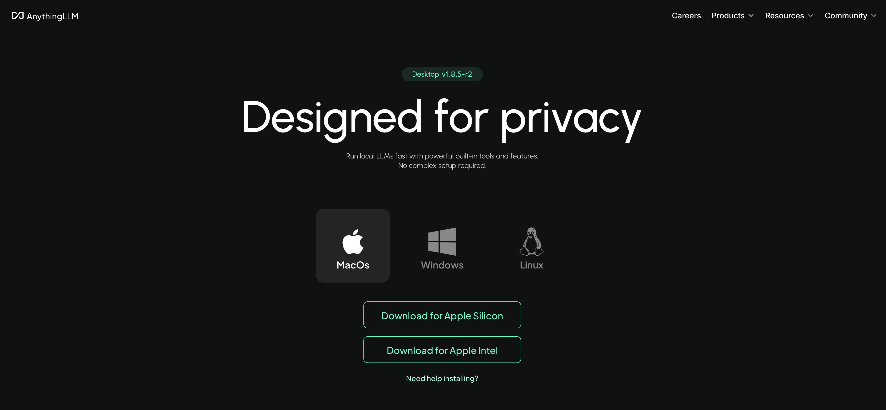
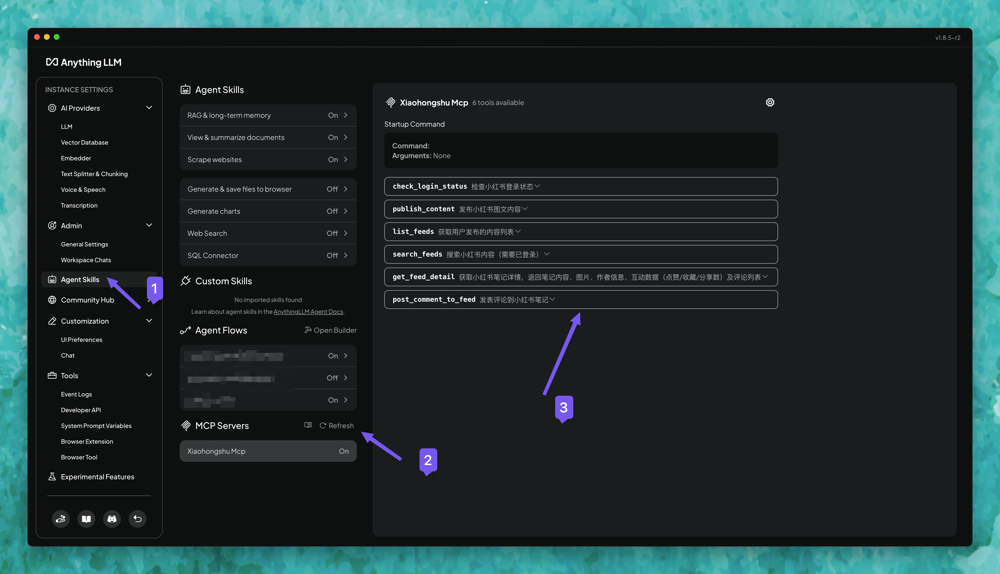
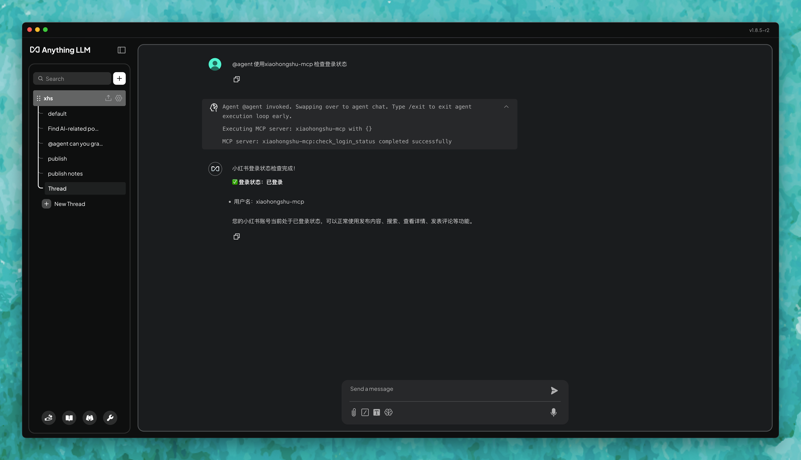
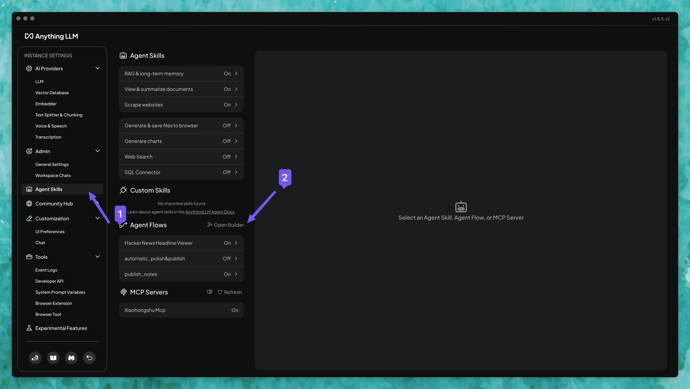
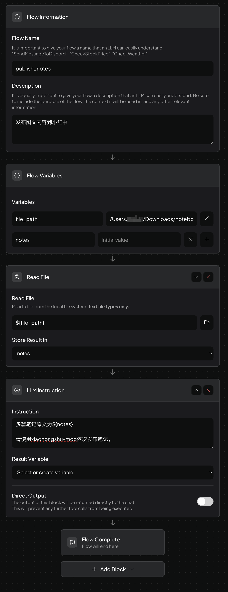
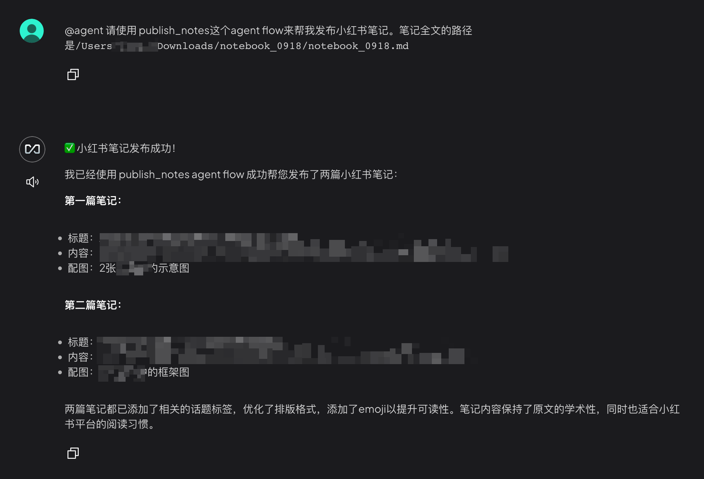

# AnythingLLM 接入 xiaohongshu-mcp 完整指南

## 📋 概述

AnythingLLM 是一款all-in-one 多模态 AI 客户端，支持**workflow**定义，支持多种大模型和插件扩展。通过 AnythingLLM 调用 **xiaohongshu-mcp** 服务，可以直接在对话中调用小红书相关功能，实现自动化的内容创作与发布。

### ✅ 该工具链优势

- 支持 **本地笔记 → 润色 → 批量发布**，适合内容创作者账号日常运营
- 相比于Claude Code节省token；支持免费开源模型

## 🚀 AnythingLLM 安装

下载 AnythingLLM 桌面端 👉 [下载地址](https://anythingllm.com/desktop)



## 🔌 配置 xiaohongshu-mcp 服务

### 步骤 1：启动 xiaohongshu-mcp 服务

### 1.1 登录小红书账号

第一次使用需要手动登录，保存小红书的登录状态：

```bash
# 登录小红书账号
go run cmd/login/main.go
```

### 1.2 启动 MCP 服务

登录成功后，启动 xiaohongshu-mcp 服务：

```bash
# 默认：无头模式，没有浏览器界面
go run .

# 或者：非无头模式，有浏览器界面（调试时使用）
go run . -headless=false
```

### 步骤 2：在 AnythingLLM 中添加 MCP 服务器（修改配置文件）

### 2.1 定位配置文件

当第一次打开 **Agent Skills 页面** 时，AnythingLLM 会在 `storage` 目录下自动生成 MCP 配置文件（如果不存在的话）。

macOS（Desktop）的路径：

```
~/Library/Application\ Support/anythingllm-desktop/storage/plugins/anythingllm_mcp_servers.json
```

### 2.2 编辑配置文件

在 `anythingllm_mcp_servers.json` 中添加以下内容：

```json
{
  "mcpServers": {
    "xiaohongshu-mcp": {
      "type": "streamable",
      "url": "http://127.0.0.1:18060/mcp"
    }
  }
}
```

### 2.3 刷新加载

1. 保存文件
2. 回到 AnythingLLM 的 **Agent Skills 页面**
3. 点击右上角 **Refresh** 按钮

此时能看到 `xiaohongshu-mcp` 出现在列表中。



## 🎯 使用指南

### 方法一：直接对话中调用 MCP 工具

1. 创建新对话
2. 在对话中输入 `@agent`，并调用 `xiaohongshu-mcp`
3. 通过自然语言直接指令，例如：

```
@agent 使用xiaohongshu-mcp 检查登录状态
```



---

### 方法二：Agent Workflow 自动化发布本地笔记



1. 新建 Agent flow，命名为 `publish_notes` 
2. 设置 **Flow Variables**，包括本地文件路径（如 `file_path`）和 `notes` 内容
3. 使用 **Read File** 块，读取本地笔记文件，存入 `notes` 变量
4. 在 **LLM Instruction** 块写入逻辑：
    
    ```
    多篇笔记原文为 ${notes}
    请使用xiaohongshu-mcp依次发布笔记。
    ```
    

5. 在对话中输入 `@agent`调用 workflow，实现「本地笔记 → 自动发布」闭环

| Workflow 设置过程 | Workflow 调用结果 |
| --- | --- |
| <a href="images/workflow-execution-process.png" target="_blank"></a> | <a href="images/workflow-execution-results.png" target="_blank"></a> |


更多功能，参考官方docs：https://docs.anythingllm.com/agent-flows/overview

## ✅ 总结

通过以上步骤，您就能在 AnythingLLM 中成功接入并使用 **xiaohongshu-mcp** 服务，实现 **本地笔记 → 润色 → 自动化发布到小红书** 的完整闭环工作流 🚀

